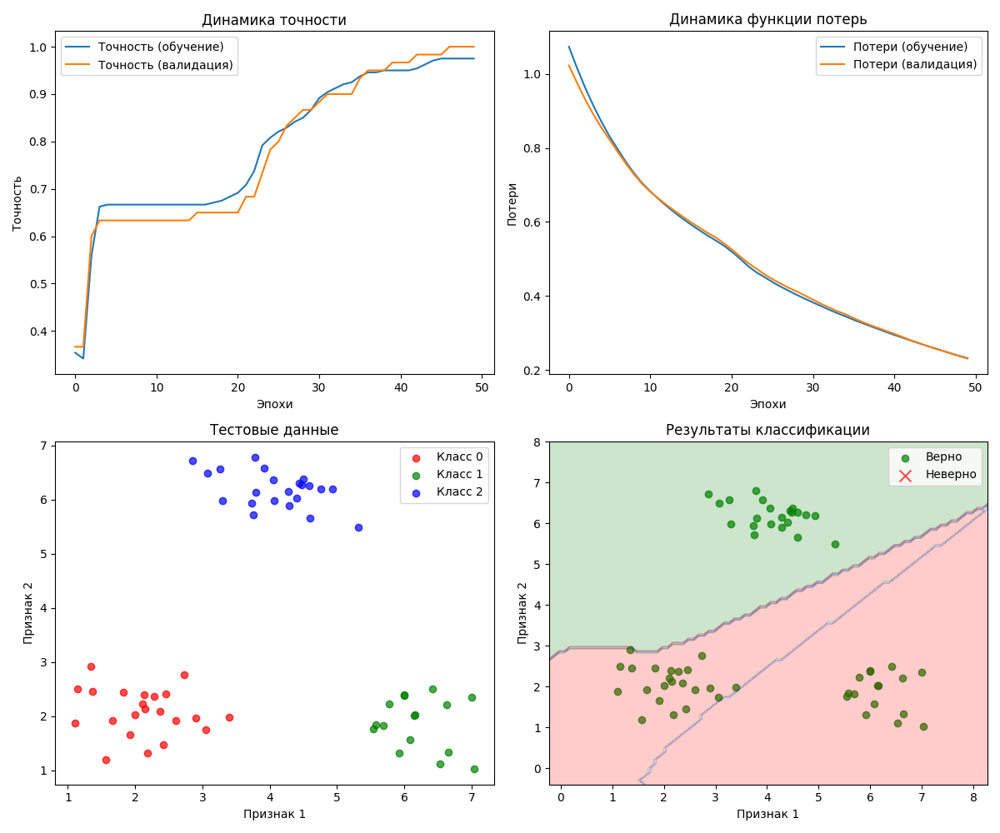

# Лабораторная работа №1: Решение задачи многоклассовой классификации

Этот проект представляет собой реализацию нейросетевой модели для решения задачи многоклассовой классификации на синтетическом наборе данных.

## Описание программы

Программа выполняет следующие шаги:

1.  **Генерация данных**: Создается синтетический набор данных, состоящий из 300 точек, разделенных на 3 четко выраженных кластера. Каждый кластер представляет отдельный класс.
2.  **Подготовка данных**: Данные разделяются на обучающую (80%) и тестовую (20%) выборки. Метки классов преобразуются в формат one-hot encoding для совместимости с функцией потерь `categorical_crossentropy`.
3.  **Построение модели**: Создается простая последовательная нейронная сеть (`Sequential`) с двумя скрытыми слоями.
    - Входной слой: принимает данные размерности (2,).
    - Первый скрытый слой: 10 нейронов, функция активации `ReLU`.
    - Второй скрытый слой: 8 нейронов, функция активации `ReLU`.
    - Выходной слой: 3 нейрона (по количеству классов), функция активации `softmax` для получения вероятностного распределения по классам.
4.  **Обучение**: Модель компилируется с оптимизатором `adam` и функцией потерь `categorical_crossentropy`. Обучение происходит в течение 50 эпох.
5.  **Оценка и визуализация**: После обучения модель оценивается на тестовой выборке. Программа выводит метрики качества (точность, отчет о классификации, матрицу ошибок) и строит графики для визуализации процесса обучения и результатов классификации.

## Результаты выполнения

### Вывод в консоль

```
Общее количество данных: 300
Количество классов: 3
Размер обучающей выборки: 240
Размер тестовой выборки: 60
Структура модели:
Model: "sequential"
┏━━━━━━━━━━━━━━━━━━━━━━━━━━━━━━━━━━━━━━┳━━━━━━━━━━━━━━━━━━━━━━━━━━━━━┳━━━━━━━━━━━━━━━━━┓
┃ Layer (type)                         ┃ Output Shape                ┃         Param # ┃
┡━━━━━━━━━━━━━━━━━━━━━━━━━━━━━━━━━━━━━━╇━━━━━━━━━━━━━━━━━━━━━━━━━━━━━╇━━━━━━━━━━━━━━━━━┩
│ dense (Dense)                        │ (None, 10)                  │              30 │
├──────────────────────────────────────┼─────────────────────────────┼─────────────────┤
│ dense_1 (Dense)                      │ (None, 8)                   │              88 │
├──────────────────────────────────────┼─────────────────────────────┼─────────────────┤
│ dense_2 (Dense)                      │ (None, 3)                   │              27 │
└──────────────────────────────────────┴─────────────────────────────┴─────────────────┘
 Total params: 145 (580.00 B)
 Trainable params: 145 (580.00 B)
 Non-trainable params: 0 (0.00 B)

Потери на тестовой выборке: 0.2308
Точность на тестовой выборке: 1.0000

Отчет о классификации:
              precision    recall  f1-score   support

           0       1.00      1.00      1.00        22
           1       1.00      1.00      1.00        16
           2       1.00      1.00      1.00        22

    accuracy                           1.00        60
   macro avg       1.00      1.00      1.00        60
weighted avg       1.00      1.00      1.00        60


Матрица ошибок:
[[22  0  0]
 [ 0 16  0]
 [ 0  0 22]]
```

### Графики результатов



## Выводы

Как видно из результатов, модель достигла **100% точности** на тестовой выборке.

- **Графики обучения** показывают стабильный рост точности и снижение потерь, что свидетельствует об успешном процессе обучения.
- **Матрица ошибок** является диагональной, что означает отсутствие ошибок классификации.
- **Визуализация результатов** подтверждает, что модель построила идеальные границы решений, которые безошибочно разделяют все три класса.

Это образцовый результат, который говорит о том, что выбранная архитектура нейросети отлично подходит для данной задачи с четко разделимыми данными. 